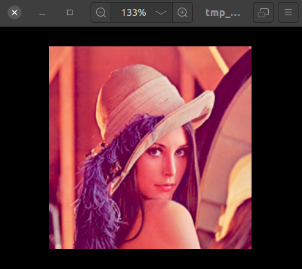

<h1 align="center">:computer: Lossy Pied Piper :rocket:</h1>

 

 

---

<h2>Motivation:</h2>

With the advent of powerful image sensors that provide very high-quality images, image  compression has become a necessity. Images have to be transferred over large distances  viz space telescopes, rendered on mobile phones having weaker internet connection and  be used in various other applications. Our project aims to address some of these issues  by using Discrete Wavelet Transform (DWT) based Image Compression, with the use of Haar Transform for lossy compression in Python3.

### Features:

* [x] Allows multiple image compression in one run. 
* [x] Supports four image file formats: .jpg, .bmp, .png, .tif.
* [x] Displays the original, compressed and recreated images.  
* [x] Displays Compression Ratio (CR). 

---

<h3 align="center">Lossy Pied Piper as a Desktop App:</h3>

<h4 align="center">Landing Page</h4>

 
<h4 align="center">Choose Images</h4>

 
<h4 align="center">Output Screen</h4>

 
<h4 align="center">Original Image</h4>

 
<h4 align="center">Compressed Representation</h4>

 
<h4 align="center">Recreated Image</h4>

 

---

### Future scope of this project:

* [ ] Allow user to choose the type of transform.  
* [ ] Allow user to set decomposition levels and perform multi-decomposition DWT.  
* [ ] Export recreated images in different formats.

### Tech Stack of this Project:

* Frontend: Tkinter
* Backend: Python3
* IDE: Sublime Text Editor
* Dependencies: Libraries mentioned in [requirements.txt](./requirements.txt). 
---

#### To run this project:

1. Clone this repository:
	* `git clone https://github.com/arghyadeep99/Lossy-Pied-Piper.git`
2. Change current working directory to this repository. 
3. Run `pip3 -r requirements.txt`
4. Run `sudo apt-get install python3-tk`
5. Run `python3 app.py`.
6. The tkinter app landing screen should open. Choose n images for compression. 
7. The app will soon display the links to original image, compressed representation and recreated image along with the Compression Ratio (CR) for each image. 

#### This project still has scope of development, so you can also contribute to this Project as follows:
* [Fork](https://github.com/arghyadeep99/Lossy-Pied-Piper) this Repository.
* Clone your Fork on a different branch:
	* `git clone -b <name-of-branch> https://github.com/arghyadeep99/Lossy-Pied-Piper.git`
* After adding any feature:
	* Goto your fork and create a pull request.
	* We will test your modifications and merge changes.

<b> This project was done as a mini project for our Digital Signal and Image Processing course. </b>

---

<h3 align="center"><b>Developed with :heart: by <a href="https://github.com/arghyadeep99">Arghyadeep Das</a>, <a href="https://github.com/gaurangathavale">Gaurang Athavale</a> and <a href="https://github.com/g-bhagwanani">Gaurav Bhagwanani</a>.</b></h1>

